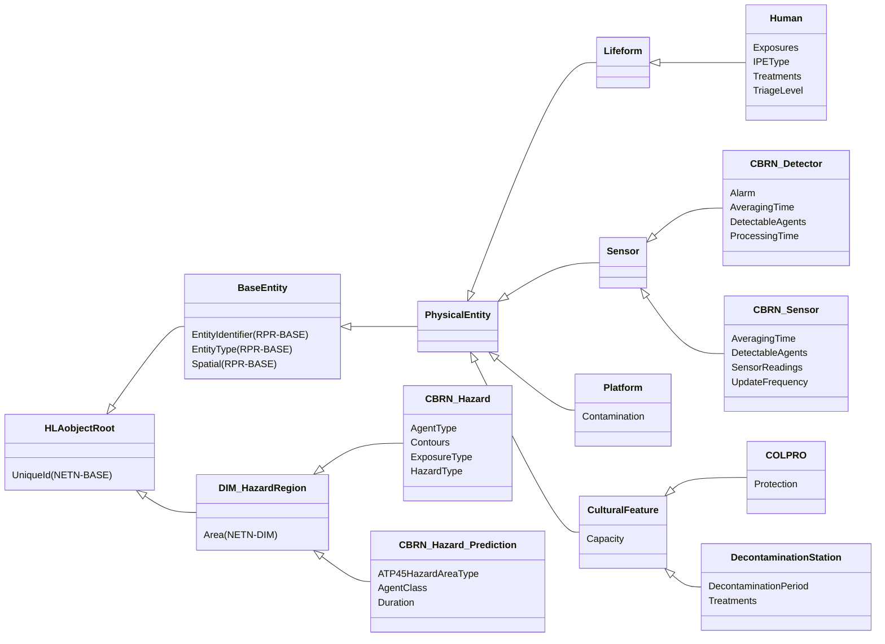
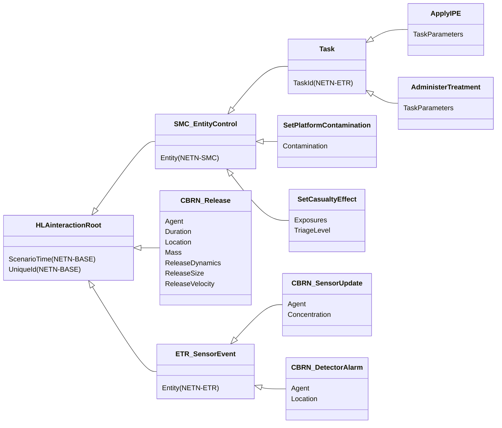

# NETN-CBRN
|Version| Date| Dependencies|
|---|---|---|
|v2.0|2023-12-09|RPR-Physical, NETN-DIM, NETN-BASE, NETN-ETR|

The NATO Education and Training Network (NETN) CBRN FOM Module (NETN-CBRN) provides a common standard interface for the representation of CBRN release, detection, effects, and protective measures in a federated distributed simulation. E.g the exposure effect on individual humans in a CBRN contaminated Hazard area where the human is represented in one simulation and the effect is modelled in another federate simulation.

CBRN are Chemical, Biological, Radiological and Nuclear materials that can be delivered intentionally as a weapon using conventional bombs, explosive materials and enhanced blast weapons (e.g., dirty bombs) or unintentionally caused by human error or natural or technological reasons, such as spills, accidental releases or leakages. 

The NETN-CBRN FOM Module is a specification of how to model CBRN-related events in a federated distributed simulation. 

The specification is based on IEEE 1516 High Level Architecture (HLA) Object Model Template (OMT) and is primarily intended to support interoperability in a federated simulation (federation) based on HLA. A Federation Object Model (FOM) Module is used to specify how data is represented and exchanged in the federation. The NETN-CBRN FOM module is available as an XML file for use in HLA-based federations. 

The NETN-CBRN FOM module covers:  
        
1.	CBRN Source release modelling 
2.	CBRN Detector modelling 
3.	CBRN Effects modelling 
4.	CBRN Protective measures modelling
5.	Hazard area modelling  
 
 Meteorological conditions and CBRN material properties for modelling the dispersion of CBRN material are not explicitly represented in the NETN-CBRN FOM Module. NETN-METOC FOM module can be used to model weather conditions that may impact the dispersion of CBRN materials and cause dynamic change to hazard areas.

## Object Classes

### Human

A human lifeform.

|Attribute|Datatype|Semantics|
|---|---|---|
|Exposures|ArrayOfCBRNExposureStruct|Array of agents to which this entity has been exposed to. Defaults to an empty array.|
|IPEType|IPETypeEnum8|Type of IPE that the entity is using. Defaults to None.|
|Treatments|ArrayOfTreatmentStruct|The types of treatment that this entity has used. Defaults to an empty array.|
|TriageLevel|CBRNDamageEnum8|Triage level of this entity. Defaults to Uninjured.|
|EntityIdentifier (RPR-BASE)|EntityIdentifierStruct|The unique identifier for the entity instance.| 
|EntityType (RPR-BASE)|EntityTypeStruct|The category of the entity.| 
|Spatial (RPR-BASE)|SpatialVariantStruct|Spatial state stored in one variant record attribute.| 
|UniqueId (NETN-BASE)|UUID|Required. A unique identifier for the object. The Universally Unique Identifier (UUID) is generated or pre-defined.| 

### CBRN_Detector

Represents a CBRN detector. This object is used to pass information to a CBRN federate, which will model the detector internally and publish a CBRN_DetectorAlarm.

|Attribute|Datatype|Semantics|
|---|---|---|
|Alarm|CBRNAlarmStruct|Data representing the alarm of this detector. Defaults to no alarm if the attribute is not set.|
|AveragingTime|TimeSecondInteger32|Duration the detector will collect samples.|
|DetectableAgents|ArrayOfAgentConcentrationStruct|Array of detectable agents and their thresholds.|
|ProcessingTime|TimeSecondInteger32|Duration between the detector being exposed to a concentration of agent above its threshold and the detector raising an alarm.|
|EntityIdentifier (RPR-BASE)|EntityIdentifierStruct|The unique identifier for the entity instance.| 
|EntityType (RPR-BASE)|EntityTypeStruct|The category of the entity.| 
|Spatial (RPR-BASE)|SpatialVariantStruct|Spatial state stored in one variant record attribute.| 
|UniqueId (NETN-BASE)|UUID|Required. A unique identifier for the object. The Universally Unique Identifier (UUID) is generated or pre-defined.| 

### CBRN_Sensor

Represents a CBRN sensor. This object is used to pass information to a CBRN federate, which will return sensor readings by publishing CBRN_SensorUpdate interactions.

|Attribute|Datatype|Semantics|
|---|---|---|
|AveragingTime|TimeSecondInteger32|Duration the sensor will collect samples.|
|DetectableAgents|ArrayOfAgentTypeEnum|Array of agents that this sensor wishes to detect.|
|SensorReadings|ArrayOfCBRNSensorReadingStruct|Latest sensor readings. Defaults to no readings if this attribute is not set.|
|UpdateFrequency|TimeSecondInteger32|Duration that this sensor would like between updated readings.|
|EntityIdentifier (RPR-BASE)|EntityIdentifierStruct|The unique identifier for the entity instance.| 
|EntityType (RPR-BASE)|EntityTypeStruct|The category of the entity.| 
|Spatial (RPR-BASE)|SpatialVariantStruct|Spatial state stored in one variant record attribute.| 
|UniqueId (NETN-BASE)|UUID|Required. A unique identifier for the object. The Universally Unique Identifier (UUID) is generated or pre-defined.| 

### Platform

A physical object under the control of armed forces upon which sensor, communication, or weapon systems may be mounted.

|Attribute|Datatype|Semantics|
|---|---|---|
|Contamination|ArrayOfAgentMassStruct|CBRN hazardous agent inside vehicle due to embedded units.|
|EntityIdentifier (RPR-BASE)|EntityIdentifierStruct|The unique identifier for the entity instance.| 
|EntityType (RPR-BASE)|EntityTypeStruct|The category of the entity.| 
|Spatial (RPR-BASE)|SpatialVariantStruct|Spatial state stored in one variant record attribute.| 
|UniqueId (NETN-BASE)|UUID|Required. A unique identifier for the object. The Universally Unique Identifier (UUID) is generated or pre-defined.| 

### CulturalFeature

Engineering and natural effects such as craters, bridges, vehicle tracks, etc.

|Attribute|Datatype|Semantics|
|---|---|---|
|Capacity|QuantityInt32|Required: The number of entities that this cultural feature can handle.|
|EntityIdentifier (RPR-BASE)|EntityIdentifierStruct|The unique identifier for the entity instance.| 
|EntityType (RPR-BASE)|EntityTypeStruct|The category of the entity.| 
|Spatial (RPR-BASE)|SpatialVariantStruct|Spatial state stored in one variant record attribute.| 
|UniqueId (NETN-BASE)|UUID|Required. A unique identifier for the object. The Universally Unique Identifier (UUID) is generated or pre-defined.| 

### COLPRO

Represents a feature that provides Collective Protection (COLPRO) against a CBRN threat.

|Attribute|Datatype|Semantics|
|---|---|---|
|Capacity|QuantityInt32|Required: The number of entities that this cultural feature can handle.|
|Protection|ArrayOfProtectionEffectivenessStruct|The effectiveness that this COLPRO offers for each agent.|
|EntityIdentifier (RPR-BASE)|EntityIdentifierStruct|The unique identifier for the entity instance.| 
|EntityType (RPR-BASE)|EntityTypeStruct|The category of the entity.| 
|Spatial (RPR-BASE)|SpatialVariantStruct|Spatial state stored in one variant record attribute.| 
|UniqueId (NETN-BASE)|UUID|Required. A unique identifier for the object. The Universally Unique Identifier (UUID) is generated or pre-defined.| 

### DecontaminationStation

Represents a feature that provides treatment for CBRN exposure.

|Attribute|Datatype|Semantics|
|---|---|---|
|Capacity|QuantityInt32|Required: The number of entities that this cultural feature can handle.|
|DecontaminationPeriod|TimeSecondInteger32|Required: Duration it takes to decontaminate an entity.|
|Treatments|ArrayOfTreatmentStruct|Required: The types of treatment that this decontamination station currently offers.|
|EntityIdentifier (RPR-BASE)|EntityIdentifierStruct|The unique identifier for the entity instance.| 
|EntityType (RPR-BASE)|EntityTypeStruct|The category of the entity.| 
|Spatial (RPR-BASE)|SpatialVariantStruct|Spatial state stored in one variant record attribute.| 
|UniqueId (NETN-BASE)|UUID|Required. A unique identifier for the object. The Universally Unique Identifier (UUID) is generated or pre-defined.| 

### CBRN_Hazard

A generic representation of a CBRN Hazard.

|Attribute|Datatype|Semantics|
|---|---|---|
|AgentType|AgentTypeEnum16|Requierd: Agent reflected in this contour.|
|Contours|ArrayOfContourStruct|Optional: Array of contours. These should be ordered in a sequence of ascending PercentProbabilityLevel.|
|ExposureType|ExposureTypeEnum8|Optional: The type of exposure.|
|HazardType|HazardTypeEnum8|Type of hazard.|
|Area (NETN-DIM)|GeodeticPolygon|Required: Geographical boundary of the HazardRegion.| 
|UniqueId (NETN-BASE)|UUID|Required. A unique identifier for the object. The Universally Unique Identifier (UUID) is generated or pre-defined.| 

### CBRN_Hazard_Prediction

Represents the footprint generated by a CBRN warning and reporting simulation. This follows the NATO ATP-45 doctrine to generate a hazard area.

|Attribute|Datatype|Semantics|
|---|---|---|
|ATP45HazardAreaType|ATP45HazardAreaTypeEnum8|This hazard area's type|
|AgentClass|AgentClassEnum8|The agent class|
|Duration|TimeSecondInteger32|Duration  that this hazard prediction is valid.|
|Area (NETN-DIM)|GeodeticPolygon|Required: Geographical boundary of the HazardRegion.| 
|UniqueId (NETN-BASE)|UUID|Required. A unique identifier for the object. The Universally Unique Identifier (UUID) is generated or pre-defined.| 

## Interaction Classes

### ApplyIPE

Represents an task for the specified entities to use individual protective equipment.

|Parameter|Datatype|Semantics|
|---|---|---|
|TaskParameters|ApplyIPETaskStruct|Required: Task parameters.|
|Entity (NETN-SMC)|UUID|Reference to a simulation entity for which the control action is intended.| 
|ScenarioTime (NETN-BASE)|EpochTime|Optional: Scenario time when the interaction was sent. Scenario time is milliseconds since Epoch, where Epoch is January 1, 1970, 00:00:00 UTC or otherwise defined in federation agreements. Default is interpreted as the receivers scenario time when the interaction is received.| 
|TaskId (NETN-ETR)|UUID|Required. Unique identifier for the task.| 
|UniqueId (NETN-BASE)|UUID|Optional: A unique identifier for the interaction.| 

### AdministerTreatment

Represents an order for the specified entities to receive the list of treatments.

|Parameter|Datatype|Semantics|
|---|---|---|
|TaskParameters|AdministerTreatmentTaskStruct|Required: Task parameters.|
|Entity (NETN-SMC)|UUID|Reference to a simulation entity for which the control action is intended.| 
|ScenarioTime (NETN-BASE)|EpochTime|Optional: Scenario time when the interaction was sent. Scenario time is milliseconds since Epoch, where Epoch is January 1, 1970, 00:00:00 UTC or otherwise defined in federation agreements. Default is interpreted as the receivers scenario time when the interaction is received.| 
|TaskId (NETN-ETR)|UUID|Required. Unique identifier for the task.| 
|UniqueId (NETN-BASE)|UUID|Optional: A unique identifier for the interaction.| 

### SetPlatformContamination

Represents an update to the contaminating mass inside a vehicle due to embedded entities.

|Parameter|Datatype|Semantics|
|---|---|---|
|Contamination|ArrayOfAgentMassStruct|New state of CBRN hazardous agent inside vehicle due to embedded units.|
|Entity (NETN-SMC)|UUID|Reference to a simulation entity for which the control action is intended.| 
|ScenarioTime (NETN-BASE)|EpochTime|Optional: Scenario time when the interaction was sent. Scenario time is milliseconds since Epoch, where Epoch is January 1, 1970, 00:00:00 UTC or otherwise defined in federation agreements. Default is interpreted as the receivers scenario time when the interaction is received.| 
|UniqueId (NETN-BASE)|UUID|Optional: A unique identifier for the interaction.| 

### SetCasualtyEffect

Informs the federate representing the entity of the casualty effects of exposure.

|Parameter|Datatype|Semantics|
|---|---|---|
|Exposures|ArrayOfCBRNExposureStruct|Optional: Array of agents to which this unit has been exposed.|
|TriageLevel|CBRNDamageEnum8|Required: Triage level of this entity.|
|Entity (NETN-SMC)|UUID|Reference to a simulation entity for which the control action is intended.| 
|ScenarioTime (NETN-BASE)|EpochTime|Optional: Scenario time when the interaction was sent. Scenario time is milliseconds since Epoch, where Epoch is January 1, 1970, 00:00:00 UTC or otherwise defined in federation agreements. Default is interpreted as the receivers scenario time when the interaction is received.| 
|UniqueId (NETN-BASE)|UUID|Optional: A unique identifier for the interaction.| 

### CBRN_Release

Communicates information associated with the release of hazardous agent.

|Parameter|Datatype|Semantics|
|---|---|---|
|Agent|AgentTypeEnum16|The type of released CBRN hazardous agent.|
|Duration|TimeSecondInteger32|Duration the release takes place.|
|Location|LocationStruct|Initial location of the release in the geocentric location system.|
|Mass|MassKilogramFloat32|Total released agent mass in kg.|
|ReleaseDynamics|ReleaseDynamicsStruct|Temperature differance and density ratio of released material relative to the atmosphere.|
|ReleaseSize|ReleaseSizeStruct|The initial size of the release including initial Gaussian sigmas of the released puff and mean & variance of released particles.|
|ReleaseVelocity|VelocityVectorStruct|Velocity of the source term.|
|ScenarioTime (NETN-BASE)|EpochTime|Optional: Scenario time when the interaction was sent. Scenario time is milliseconds since Epoch, where Epoch is January 1, 1970, 00:00:00 UTC or otherwise defined in federation agreements. Default is interpreted as the receivers scenario time when the interaction is received.| 
|UniqueId (NETN-BASE)|UUID|Optional: A unique identifier for the interaction.| 

### CBRN_SensorUpdate

Sends information about the current state of a previously registered CBRN sensor.

|Parameter|Datatype|Semantics|
|---|---|---|
|Agent|AgentTypeEnum16|Required: Type of the agent.|
|Concentration|MassConcentrationFloat32|Required: Mean Concentration in kg m-3.|
|Entity (NETN-ETR)|UUID|Optional: Reference to an entity with a sensor producing the sensor event. Default is no specific entity referenced.| 
|ScenarioTime (NETN-BASE)|EpochTime|Optional: Scenario time when the interaction was sent. Scenario time is milliseconds since Epoch, where Epoch is January 1, 1970, 00:00:00 UTC or otherwise defined in federation agreements. Default is interpreted as the receivers scenario time when the interaction is received.| 
|UniqueId (NETN-BASE)|UUID|Optional: A unique identifier for the interaction.| 

### CBRN_DetectorAlarm

Represents the alarm trigger of a previously registered CBRN detector.

|Parameter|Datatype|Semantics|
|---|---|---|
|Agent|AgentTypeEnum16|Enumeration representation of the agent.|
|Location|LocationStruct|Required: Location of the detection (location of Detector)|
|Entity (NETN-ETR)|UUID|Optional: Reference to an entity with a sensor producing the sensor event. Default is no specific entity referenced.| 
|ScenarioTime (NETN-BASE)|EpochTime|Optional: Scenario time when the interaction was sent. Scenario time is milliseconds since Epoch, where Epoch is January 1, 1970, 00:00:00 UTC or otherwise defined in federation agreements. Default is interpreted as the receivers scenario time when the interaction is received.| 
|UniqueId (NETN-BASE)|UUID|Optional: A unique identifier for the interaction.| 

## Datatypes

Note that only datatypes defined in this FOM Module are listed below. Please refer to FOM Modules on which this module depends for other referenced datatypes.

### Overview
|Name|Semantics|
|---|---|
|ATP45HazardAreaTypeEnum8|Type of ATP-45 Hazard Area (simple or detailed).|
|AdministerTreatmentTaskStruct|Task-specific data.|
|AgentClassEnum8|Class of Agent for an ATP-45 Hazard Area.|
|AgentConcentrationStruct|Concentration value associated with a specific agent.|
|AgentMassStruct|Mass of contaminant inside a vehicle brought in by an embedded unit.|
|AgentTypeEnum16|Type of CBRN hazardous agent.|
|ApplyIPETaskStruct|Task-specific data.|
|ArrayOfAgentConcentrationStruct|Array of agents and their concentrations.|
|ArrayOfAgentMassStruct|Array of agents and their masses.|
|ArrayOfAgentTypeEnum|Array of agents.|
|ArrayOfCBRNExposureStruct|Array of agents and their dosages.|
|ArrayOfCBRNSensorReadingStruct|Array of sensor readings.|
|ArrayOfContourStruct|A set of contour boundaries defining concentration levels in ascending order.|
|ArrayOfProtectionEffectivenessStruct|Array of the protection’s effectiveness.|
|ArrayOfSigmas6|Size of the initial Gaussian puff sigma values.|
|ArrayOfTreatmentStruct|Array of TreatmentStruct types.|
|CBRNAlarmStruct|Properties of a CBRN alarm.|
|CBRNDamageEnum8|Level of damage due to CBRN exposure.|
|CBRNExposureStruct|Dosage exposure value associated with a specific agent.|
|CBRNSensorReadingStruct|Timed CBRN sensor reading.|
|ContourStruct|Countour description.|
|DensityRatioFloat32|Ratio of density of two materials in range [0, 1].|
|DosageKgSecondPerMeterCubedFloat32|Dosage in SI units.|
|EntityControlActionEnum|Control actions for entities.|
|ExposureFloat32|Data type for exposure.|
|ExposureTypeEnum8|Type of exposure represented in a contour group.|
|HazardTypeEnum8|Type of dispersion output represented in a contour group.|
|IPETypeEnum8|Types of Individual Protective Equipment.|
|MeanMetersFloat32|Mean of a Gaussian distribution, based on SI unit meter, unit symbol m.|
|ProtectionEffectivenessStruct|Protection effectiveness associated with a specific agent.|
|ReleaseDistributionStruct|Mean and variance of the distribution of the particles or droplets in a release.|
|ReleaseDynamicsStruct|Defines the dynamic properties of a release.|
|ReleaseSizeStruct|Defines the properties of the initial size of a release.|
|TaskDefinitionVariantRecord|Variant record for task definition data.|
|TaskProgressVariantRecord|Variant record for task progress data.|
|TreatmentStruct|Defines the properties for a CBRN treatment.|
|VarianceMetersSquaredFloat32|Variance of a Gaussian distribution, based on SI unit meter squared, unit symbol m2.|
        
### Simple Datatypes
|Name|Units|Semantics|
|---|---|---|
|DensityRatioFloat32|NA|Ratio of density of two materials in range [0, 1].|
|DosageKgSecondPerMeterCubedFloat32|Kg Second Per Meter Cubed|Dosage in SI units.|
|ExposureFloat32|NA|Data type for exposure.|
|MeanMetersFloat32|meters|Mean of a Gaussian distribution, based on SI unit meter, unit symbol m.|
|VarianceMetersSquaredFloat32|meters squared|Variance of a Gaussian distribution, based on SI unit meter squared, unit symbol m2.|
        
### Enumerated Datatypes
|Name|Representation|Semantics|
|---|---|---|
|ATP45HazardAreaTypeEnum8|HLAoctet|Type of ATP-45 Hazard Area (simple or detailed).|
|AgentClassEnum8|HLAoctet|Class of Agent for an ATP-45 Hazard Area.|
|AgentTypeEnum16|HLAinteger16BE|Type of CBRN hazardous agent.|
|CBRNDamageEnum8|HLAoctet|Level of damage due to CBRN exposure.|
|EntityControlActionEnum|HLAinteger32BE|Control actions for entities.|
|ExposureTypeEnum8|HLAoctet|Type of exposure represented in a contour group.|
|HazardTypeEnum8|HLAoctet|Type of dispersion output represented in a contour group.|
|IPETypeEnum8|HLAoctet|Types of Individual Protective Equipment.|
        
### Array Datatypes
|Name|Element Datatype|Semantics|
|---|---|---|
|ArrayOfAgentConcentrationStruct|AgentConcentrationStruct|Array of agents and their concentrations.|
|ArrayOfAgentMassStruct|AgentMassStruct|Array of agents and their masses.|
|ArrayOfAgentTypeEnum|AgentTypeEnum16|Array of agents.|
|ArrayOfCBRNExposureStruct|CBRNExposureStruct|Array of agents and their dosages.|
|ArrayOfCBRNSensorReadingStruct|CBRNSensorReadingStruct|Array of sensor readings.|
|ArrayOfContourStruct|ContourStruct|A set of contour boundaries defining concentration levels in ascending order.|
|ArrayOfProtectionEffectivenessStruct|ProtectionEffectivenessStruct|Array of the protection’s effectiveness.|
|ArrayOfSigmas6|LengthMeterFloat32|Size of the initial Gaussian puff sigma values.|
|ArrayOfTreatmentStruct|TreatmentStruct|Array of TreatmentStruct types.|
        
### Fixed Record Datatypes
|Name|Fields|Semantics|
|---|---|---|
|AdministerTreatmentTaskStruct|Entities, Treatment, Duration|Task-specific data.|
|AgentConcentrationStruct|MeanConcentration, Agent|Concentration value associated with a specific agent.|
|AgentMassStruct|ContaminatedMass, Agent|Mass of contaminant inside a vehicle brought in by an embedded unit.|
|ApplyIPETaskStruct|IPEType|Task-specific data.|
|CBRNAlarmStruct|Location, Agent|Properties of a CBRN alarm.|
|CBRNExposureStruct|Exposure, Agent|Dosage exposure value associated with a specific agent.|
|CBRNSensorReadingStruct|Time, Reading|Timed CBRN sensor reading.|
|ContourStruct|Boundary, ProbabilityLevel, ConcentrationLevel|Countour description.|
|ProtectionEffectivenessStruct|Effectiveness, Agent|Protection effectiveness associated with a specific agent.|
|ReleaseDistributionStruct|Mean, Variance|Mean and variance of the distribution of the particles or droplets in a release.|
|ReleaseDynamicsStruct|DensityRatio, TemperatureDifference|Defines the dynamic properties of a release.|
|ReleaseSizeStruct|SigmaArray, ReleaseDistribution|Defines the properties of the initial size of a release.|
|TreatmentStruct|Effectiveness, Duration, TreatmentWindow, TreatableAgents|Defines the properties for a CBRN treatment.|
        
### Variant Record Datatypes
|Name|Discriminant (Datatype)|Alternatives|Semantics|
|---|---|---|---|
|TaskDefinitionVariantRecord|TaskType (EntityControlActionEnum)|ApplyIPE, AdministerTreatment|Variant record for task definition data.|
|TaskProgressVariantRecord|TaskType (EntityControlActionEnum)|Treatment|Variant record for task progress data.|
    