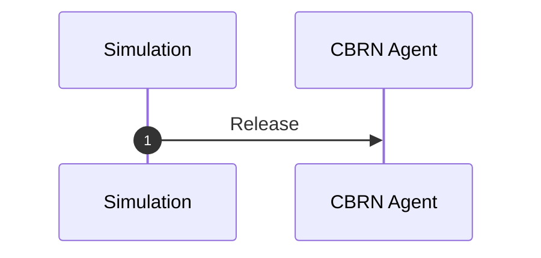
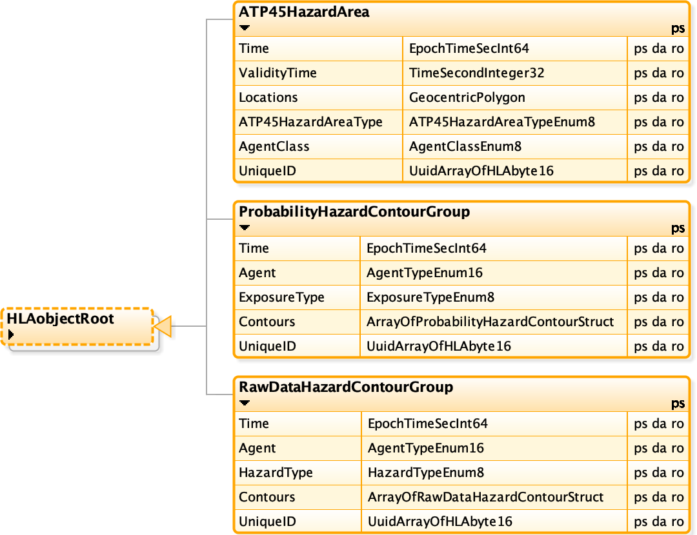
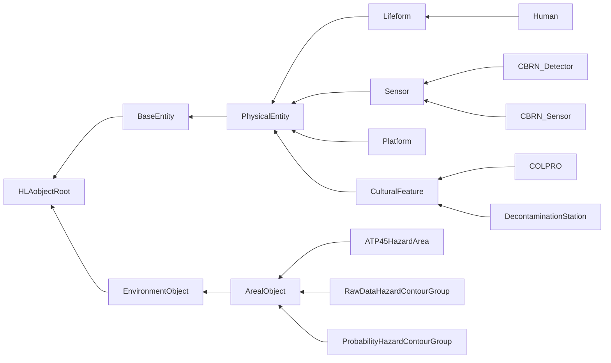
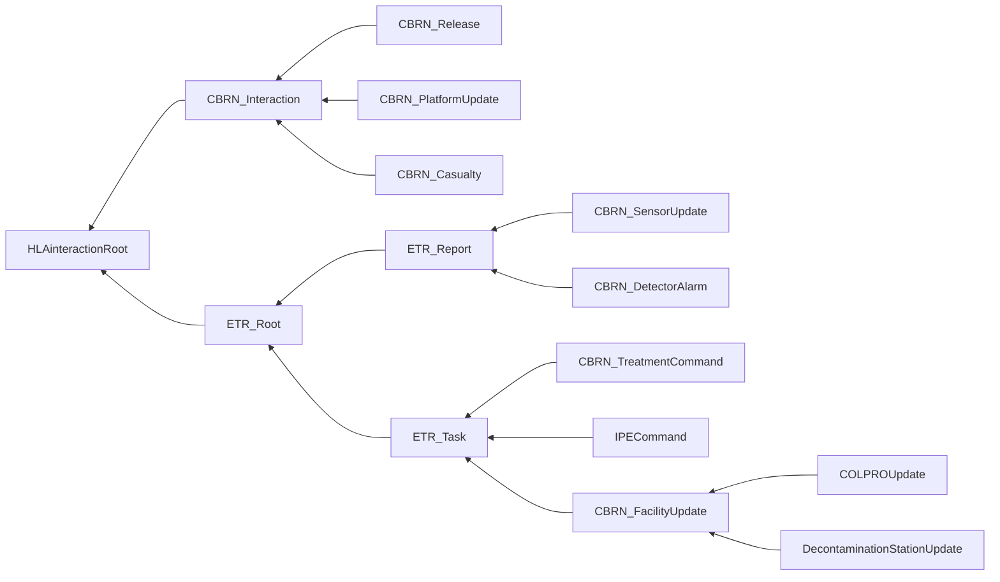

# NETN-CBRN
|Version| Date| Dependencies|
|---|---|---|
|v2.0|2023-03-28|NETN-Physical, NETN-SE|

The NATO Education and Training Network (NETN) CBRN FOM Module (NETN-CBRN) provides a common standard interface for the representation of CBRN release, detection, effects, and protective measures in a federated distributed simulation. E.g the exposure effect on individual humans in a CBRN contaminated Hazard area where the human is represented in one simulation and the effect is modelled in another federate simulation.

CBRN are Chemical, Biological, Radiological and Nuclear materials that can be delivered intentionally as a weapon using conventional bombs, explosive materials and enhanced blast weapons (e.g., dirty bombs) or unintentionally caused by human error or natural or technological reasons, such as spills, accidental releases or leakages. 

The NETN-CBRN FOM Module is a specification of how to model CBRN-related events in a federated distributed simulation. 

The specification is based on IEEE 1516 High Level Architecture (HLA) Object Model Template (OMT) and is primarily intended to support interoperability in a federated simulation (federation) based on HLA. A Federation Object Model (FOM) Module is used to specify how data is represented and exchanged in the federation. The NETN-CBRN FOM module is available as an XML file for use in HLA-based federations. 

The NETN-CBRN FOM module covers:  
        
1.	CBRN Source release modelling 
2.	CBRN Detector modelling 
3.	CBRN Effects modelling 
4.	CBRN Protective measures modelling
 5.	Hazard area modelling  
 
 Meteorological conditions and CBRN material properties for modelling the dispersion of CBRN material are not explicitly represented in the NETN-CBRN FOM Module. NETN-METOC FOM module can be used to model weather conditions that may impact the dispersion of CBRN materials and cause dynamic change to hazard areas.

## Overview

Modelling of CBRN involves the following aspects:
1. Triggering the release of CBRN agents 
2. Modelling the consequences of the release of a `CBRN Agent`, including concentration, spreading and the result of decontamination activities
3. The `CBRN Effect` of the CBRN agents on simulated entities
4. `CBRN Sensor` modelling
5. The `CBRN Detection` of the CBRN agents

Depending on the federation design, these aspects are modelled in one or more CBRN federates. E.g. a design where agent concentration, detection and effects are all modelled in the same federate, or a design where CBRN Sensors, CBRN Detectors, CBRN Effects and modelling of the concentration of agents are all in different federates.

### CBRN Release 

The `Release` interaction is a trigger for starting the simulation of a CBRN release.

1. The `Release` interaction is sent by the federate modelling the release event, allowing a CBRN Agent federate to start modelling the CBRN agents related to the release.

If a simulation can not directly produce the `Release` interaction, another federate can e.g. interpret an RPR-FOM Warfare `MunitionDetonation` and if the `WarheadType` parameter indicates a CBRN release, then a `Release` is generated using the `WarheadType` parameters.

### CBRN Agent 

A hazard area is a representation of a CBRN-contaminated area published in the federation. The hazard area can be either:
* The output from a hazard prediction algorithm (a warning area defined in Allied Tactical Publication (ATP)-45) in response to a detector alarm or observation. (Perceived Truth)
*   Raw output from a dispersion model (contours) in a simulation. (Ground Truth)

Figure: CBRN Hazard Area Objects.

The `ATP45HazardArea` object represents the hazard region as calculated by a warning and reporting model. Currently, only a subset of the ATP-45 definition is used.

The `ProbabilityHazardContourGroup` object provides a representation of the hazard area of the casualty effects of this CBRN hazard, calculated from the properties of the particular material.

The `RawDataHazardContourGroup` object provides a representation of the raw dispersion output, which is purely the quantity of the material calculated by a dispersion model.

### CBRN Effects 

Previous systems utilising HLA as the interoperability mechanism have used representations of damage from existing object models for representing kinetic weapons to represent CBRN exposure. The representation of damage from kinetic models does not necessarily map well to represent CBRN exposure.

This section presents the use cases and data types for CBRN casualty modelling.

### Lifeform CBRN Effects Modelling

The `CBRN_Human` object is an extension of the `NETN_Human` object from the NETN Physical FOM module. The CBRN federate will update the appropriate attributes as the casualty state of the entity changes. The TriageLevel uses the NATO representation of triage category scores. The IPEType attribute denotes the level of Individual Protective Equipment (IPE) that the unit is wearing. These levels are those defined by the Nuclear, Biological and Chemical (NBC) dress states.
 

Figure: CBRN_Human Object.

The `CBRN_Casualty` interaction is provided to give support to legacy systems that do not use the CBRN FOM module. A translation federate can then map the `CBRN_Casualty` interaction into a data type that the legacy system can handle.

Figure: CBRN_Casualty Interaction.

The triage levels used in the `CBRNDamageEnum8` enumeration uses the ‘T system’ to denote the priority of treatment for casualties where the levels are defined as:
*   T3 – Delayed priority.
*   T2 – Urgent priority.
*   T1 – Immediate priority.
*   T4 – Expectant priority (treatment would be ineffective).

## CBRN Platforms 

To calculate further contamination and exposure for a platform, extensions are made to seven NETN leaf nodes in the NETN Physical FOM module. These are all extensions of the Platform object from the RPR Physical FOM module. Each extension contains an array of the mass of all materials that are contaminating the vehicle.

Figure: CBRN Platform Objects.

Using the same pattern as that used for the `CBRN_Human` object, the contaminating mass inside a platform due to embedded units can be updated by an external federate using the `CBRN_PlatformUpdate` interaction.
 
 

Figure: CBRN_PlatformUpdate Interaction.

## Protective Measures Modelling

The use case for protective measures covers both the modelling of CBRN treatment and the modelling of CBRN protective equipment. This includes both individual (i.e. a respirator) and collective protection (i.e. Collective Protection (COLPRO)).

The `COLPRO` and `DecontaminationStation` object classes extends the `NETN_CulturalFeature` object class and provides information on how many entities it can contain as well as what agents it provides protection against.
 

Figure: CBRN Protective Measures Objects.

### Protective Measures Interactions

Figure: CBRN Protective Measures Interactions.

The `CBRN_FacilityUpdate` interactions allows entities to be instructed to enter or leave a CBRN facility.

* The `COLPROUpdate` interaction extends the CBRN_FacilityUpdate and allows entities to be instructed to enter or leave a COLPRO object.
* The `DecontaminationStationUpdate` interaction extends the CBRNFacilityUpdate and allows entities to be instructed to enter or leave a DecontaminationStation object.

The `IPECommand` interaction allows entities to be instructed to don IPE by an external federate.

The `CBRN_TreatmentCommand` can be used for both pre-mission countermeasures and for treatment to be applied post-exposure. The `CBRN_Human` object has an attribute which denotes the treatments that have been applied to the unit.
 

 

### CBRN Detection

Modelling the detection of CBRN agents in a federated simulation environment can use three different design approaches. 

1. Simulation of Either the detection modelling is handled by same federate that models the CBRN sensors or these are sparated in two 

1. Sim publish Detector, Detector modelled by CBRN federate and sends DetectorAlarms

2. Sim models detector, Sensor modelled by CBRN federate that produce sensor updates

There are two use cases for a detector in an HLA simulation:
1.  The first is for detector properties to be created and published by a simulation federate. A detector model within a CBRN federate would calculate the detector readings and publish the alarm status. This process would use the CBRN_Detector object and CBRN_DetectorAlarm interaction.
2.  The second would have a complete detector model in a federate; this would request concentration readings from a CBRN federate and calculate its alarm status. This would use the CBRN_Sensor object and CBRN_SensorUpdate interaction.

Both the `CBRN_Detector` and `CBRN_Sensor` objects extend the BaseEntity.PhysicalEntity.Sensor object in the RPR Physical FOM module.
 
### CBRN_Detector

The `CBRN_Detector` object is used when a CGF creates a detector with a CBRN federate performing the modelling of the detector. When the federate controlling the detector calculates a concentration above a threshold, it will issue a `CBRN_DetectorAlarm` interaction.

### CBRN_Sensor

The `CBRN_Sensor` object is used when there is a detector federate performing the modelling of the detector. The `CBRN_Sensor` registers the agents that it is interested in and receives readings in the form of a `CBRN_SensorUpdate` interaction.
 

## Object Classes

Note that inherited and dependency attributes are not included in the description of object classes.

### Human

A human lifeform.

|Attribute|Datatype|Semantics|
|---|---|---|
|Exposures|ArrayOfCBRNExposureStruct|Array of agents to which this entity has been exposed to. Defaults to an empty array.|
|Treatments|ArrayOfTreatmentStruct|The types of treatment that this entity has used. Defaults to an empty array.|
|TriageLevel|CBRNDamageEnum8|Triage level of this entity. Defaults to Uninjured.|
|IPEType|IPETypeEnum8|Type of IPE that the entity has donned. Defaults to None.|

### CBRN_Detector

Represents a CBRN detector. This object is used to pass information to a CBRN federate, which will model the detector internally and publish a CBRN_DetectorAlarm.

|Attribute|Datatype|Semantics|
|---|---|---|
|ProcessingTime|TimeSecondInteger32|Duration (in seconds) between the detector being exposed to a concentration of agent above its threshold and the detector raising an alarm.|
|AveragingTime|TimeSecondInteger32|Duration (in seconds) over which the detector will collect samples.|
|DetectableAgents|ArrayOfAgentConcentrationStruct|Array of detectable agents and their thresholds.|
|Alarm|CBRNAlarmStruct|Data representing the alarm of this detector. Defaults to no alarm if the attribute is not set.|

### CBRN_Sensor

Represents a CBRN sensor. This object is used to pass information to a CBRN federate, which will return sensor readings by publishing CBRN_SensorUpdate interactions.

|Attribute|Datatype|Semantics|
|---|---|---|
|UpdateFrequency|TimeSecondInteger32|Duration (in seconds) that this sensor would like between updated readings.|
|AveragingTime|TimeSecondInteger32|Duration (in seconds) over which the sensor will collect samples.|
|DetectableAgents|ArrayOfAgentTypeEnum|Array of agents that this sensor wishes to detect.|
|SensorReadings|ArrayOfCBRNSensorReadingStruct|Latest sensor readings. Defaults to no readings if this attribute is not set.|

### Platform

A physical object under the control of armed forces upon which sensor, communication, or weapon systems may be mounted.

|Attribute|Datatype|Semantics|
|---|---|---|
|Contamination|ArrayOfAgentMassStruct|CBRN hazardous agent inside vehicle due to embedded units.|

### COLPRO

Represents a feature that provides Collective Protection (COLPRO) against a CBRN threat.

|Attribute|Datatype|Semantics|
|---|---|---|
|Capacity|QuantityUInt32|The number of entities that this COLPRO can handle.|
|Protection|ArrayOfProtectionEffectivenessStruct|The effectiveness that this COLPRO offers for each agent.|

### DecontaminationStation

Represents a feature that provides treatment for CBRN exposure.

|Attribute|Datatype|Semantics|
|---|---|---|
|Capacity|QuantityUInt32|The number of entities that this decontamination station can handle.|
|DecontaminationPeriod|TimeSecondInteger32|Duration in seconds it takes to decontaminate an entity.|
|Treatments|ArrayOfTreatmentStruct|The types of treatment that this decontamination station currently offers.|

### ATP45HazardArea

Represents the footprint generated by a CBRN warning and reporting simulation. This follows the NATO ATP-45 doctrine to generate a hazard area.

|Attribute|Datatype|Semantics|
|---|---|---|
|Time|EpochTimeSecInt64|Simulation time at which this hazard area was generated.|
|ValidityTime|TimeSecondInteger32|Duration (in seconds) from the Time attribute that this hazard area prediction is valid.|
|Locations|GeocentricPolygon|Array of locations that define the hazard area|
|ATP45HazardAreaType|ATP45HazardAreaTypeEnum8|This hazard area's type|
|AgentClass|AgentClassEnum8|The agent class|

### RawDataHazardContourGroup

Represents the footprint covered by a CBRN hazard. This object covers the raw data which would be the output from a dispersion model.

|Attribute|Datatype|Semantics|
|---|---|---|
|Time|EpochTimeSecInt64|Simulation time at which this contour group was generated.|
|Agent|AgentTypeEnum16|Agent reflected in this contour.|
|HazardType|HazardTypeEnum8|Type of hazard.|
|Contours|ArrayOfRawDataHazardContourStruct|Array of contours. These should be ordered in a sequence of ascending ExposureLevel.|

### ProbabilityHazardContourGroup

Represents the footprint covered by a CBRN hazard. This object covers the agent-specific effects which would be the output from a casualty model.

|Attribute|Datatype|Semantics|
|---|---|---|
|Time|EpochTimeSecInt64|Simulation time at which this contour group was generated.|
|Agent|AgentTypeEnum16|Agent reflected in this contour.|
|ExposureType|ExposureTypeEnum8|Type of exposure.|
|Contours|ArrayOfProbabilityHazardContourStruct|Array of contours. These should be ordered in a sequence of ascending PercentProbabilityLevel.|

## Interaction Classes

Note that inherited and dependency parameters are not included in the description of interaction classes.

### CBRN_Release

Communicates information associated with the release of hazardous agent.

|Parameter|Datatype|Semantics|
|---|---|---|
|UniqueID|UUID|Unique representation of the release’s ID.|
|Agent|AgentTypeEnum16|The type of released CBRN hazardous agent.|
|Location|WorldLocationStruct|Initial location of the release in the geocentric location system.|
|Mass|MassKilogramFloat32|Total released agent mass in kg.|
|Duration|TimeSecondInteger32|Duration in seconds over which the release takes place.|
|ReleaseSize|ReleaseSizeStruct|The initial size of the release including initial Gaussian sigmas of the released puff and mean & variance of released particles.|
|ReleaseDynamics|ReleaseDynamicsStruct|Temperature differance and density ratio of released material relative to the atmosphere.|
|ReleaseVelocity|VelocityVectorStruct|Velocity of the source term.|

### CBRN_PlatformUpdate

Represents an update to the contaminating mass inside a vehicle due to embedded entities.

|Parameter|Datatype|Semantics|
|---|---|---|
|PlatformID|UUID|The unique ID of the platform.|
|Contamination|ArrayOfAgentMassStruct|New state of CBRN hazardous agent inside vehicle due to embedded units.|

### CBRN_Casualty

Represents a CBRN casualty caused by exposure. This is for use with federates that cannot support the TriageLevel attribute in CBRN_Human.

|Parameter|Datatype|Semantics|
|---|---|---|
|UniqueID|UUID|Unique representation of the entity’s ID.|
|TriageLevel|CBRNDamageEnum8|Triage level of this entity.|
|Exposures|ArrayOfCBRNExposureStruct|Array of agents to which this unit has been exposed.|

### CBRN_SensorUpdate

Sends information about the current state of a previously registered CBRN sensor.

|Parameter|Datatype|Semantics|
|---|---|---|
|Time|EpochTimeSecInt64|Time of this sensor update|
|SensorID|UUID|Unique representation of the sensor’s ID.|
|Readings|ArrayOfAgentConcentrationStruct|Readings for this sensor|

### CBRN_DetectorAlarm

Represents the alarm trigger of a previously registered CBRN detector.

|Parameter|Datatype|Semantics|
|---|---|---|
|DetectorID|UUID|Unique representation of the detector’s ID.|
|Alarm|CBRNAlarmStruct|Details of the alarm.|

### CBRN_TreatmentCommand

Represents an order for the specified entities to receive the list of treatments.

|Parameter|Datatype|Semantics|
|---|---|---|
|UnitList|ArrayOfUuid|List of unique IDs of the entities who will receive the treatment.|
|Treatments|TreatmentStruct|Type of treatment to be applied to the entities.|

### IPECommand

Represents an order for the specified entities to don protective equipment.

|Parameter|Datatype|Semantics|
|---|---|---|
|UnitList|ArrayOfUuid|List of unique IDs of the entities who will don IPE.|
|IPEType|IPETypeEnum8|Type of IPE that the entities will don.|

### CBRN_FacilityUpdate

Represents an order for the specified entities to enter or leave the CBRN facility.

|Parameter|Datatype|Semantics|
|---|---|---|
|FacilityID|UUID|The unique ID of the CBRN facility.|
|EmbeddedUnitList|ArrayOfUuid|List of unique IDs of the entities who will enter or exit the CBRN facility.|
|IsEntry|HLAboolean|Determines whether the entities are entering (IsEntry = true) or exiting (IsEntry = false) the CBRN facility.|

### COLPROUpdate

Represents an order for the specified entities to enter or leave the COLPRO.

### DecontaminationStationUpdate

Represents an order for the specified entities to enter or leave the decontamination station.

## Datatypes

Note that only datatypes defined in this FOM Module are listed below. Please refer to FOM Modules on which this module depends for other referenced datatypes.

### Overview
|Name|Semantics|
|---|---|
|ATP45HazardAreaTypeEnum8|Type of ATP-45 Hazard Area (simple or detailed).|
|AgentClassEnum8|Class of Agent for an ATP-45 Hazard Area.|
|AgentConcentrationStruct|Concentration value associated with a specific agent.|
|AgentMassStruct|Mass of contaminant inside a vehicle brought in by an embedded unit.|
|AgentTypeEnum16|Type of CBRN hazardous agent.|
|ArrayOfAgentConcentrationStruct|Array of agents and their concentrations.|
|ArrayOfAgentMassStruct|Array of agents and their masses.|
|ArrayOfAgentTypeEnum|Array of agents.|
|ArrayOfCBRNExposureStruct|Array of agents and their dosages.|
|ArrayOfCBRNSensorReadingStruct|Array of sensor readings.|
|ArrayOfProbabilityHazardContourStruct|Array of Probability Hazard Contours.|
|ArrayOfProtectionEffectivenessStruct|Array of the protection’s effectiveness.|
|ArrayOfRawDataHazardContourStruct|Array of Raw Data Hazard Contours.|
|ArrayOfSigmas6|Size of the initial Gaussian puff sigma values.|
|ArrayOfTreatmentStruct|Array of TreatmentStruct types.|
|CBRNAlarmStruct|Properties of a CBRN alarm.|
|CBRNDamageEnum8|Level of damage due to CBRN exposure.|
|CBRNExposureStruct|Dosage exposure value associated with a specific agent.|
|CBRNSensorReadingStruct|Timed CBRN sensor reading.|
|DensityRatioFloat32|Ratio of density of two materials in range [0, 1].|
|DosageKgSecondPerMeterCubedFloat32|Dosage in SI units.|
|ExposureFloat32|Data type for exposure.|
|ExposureTypeEnum8|Type of exposure represented in a contour group.|
|GeocentricPolygon|A polygon defined as a closed polygonal chain of geocentric world locations where the last location is connected to the first.|
|HazardTypeEnum8|Type of dispersion output represented in a contour group.|
|IPETypeEnum8|Types of Individual Protective Equipment.|
|MeanMetersFloat32|Mean of a Gaussian distribution, based on SI unit meter, unit symbol m.|
|ProbabilityHazardContourStruct|Represents the footprint covered by a CBRN hazard. This object covers the agent-specific effects which would be the output from a casualty model.|
|ProtectionEffectivenessStruct|Protection effectiveness associated with a specific agent.|
|QuantityUInt32|Quantity in range [0, 2^32-1]|
|RawDataHazardContourStruct|Contour locations bounding a given exposure value.|
|ReleaseDistributionStruct|Mean and variance of the distribution of the particles or droplets in a release.|
|ReleaseDynamicsStruct|Defines the dynamic properties of a release.|
|ReleaseSizeStruct|Defines the properties of the initial size of a release.|
|TreatmentStruct|Defines the properties for a CBRN treatment.|
|VarianceMetersSquaredFloat32|Variance of a Gaussian distribution, based on SI unit meter squared, unit symbol m2.|
        
### Simple Datatypes
|Name|Units|Semantics|
|---|---|---|
|DensityRatioFloat32|NA|Ratio of density of two materials in range [0, 1].|
|DosageKgSecondPerMeterCubedFloat32|Kg Second Per Meter Cubed|Dosage in SI units.|
|ExposureFloat32|NA|Data type for exposure.|
|MeanMetersFloat32|meters|Mean of a Gaussian distribution, based on SI unit meter, unit symbol m.|
|QuantityUInt32|NA|Quantity in range [0, 2^32-1]|
|VarianceMetersSquaredFloat32|meters squared|Variance of a Gaussian distribution, based on SI unit meter squared, unit symbol m2.|
        
### Enumerated Datatypes
|Name|Representation|Semantics|
|---|---|---|
|ATP45HazardAreaTypeEnum8|HLAoctet|Type of ATP-45 Hazard Area (simple or detailed).|
|AgentClassEnum8|HLAoctet|Class of Agent for an ATP-45 Hazard Area.|
|AgentTypeEnum16|HLAinteger16BE|Type of CBRN hazardous agent.|
|CBRNDamageEnum8|HLAoctet|Level of damage due to CBRN exposure.|
|ExposureTypeEnum8|HLAoctet|Type of exposure represented in a contour group.|
|HazardTypeEnum8|HLAoctet|Type of dispersion output represented in a contour group.|
|IPETypeEnum8|HLAoctet|Types of Individual Protective Equipment.|
        
### Array Datatypes
|Name|Element Datatype|Semantics|
|---|---|---|
|ArrayOfAgentConcentrationStruct|AgentConcentrationStruct|Array of agents and their concentrations.|
|ArrayOfAgentMassStruct|AgentMassStruct|Array of agents and their masses.|
|ArrayOfAgentTypeEnum|AgentTypeEnum16|Array of agents.|
|ArrayOfCBRNExposureStruct|CBRNExposureStruct|Array of agents and their dosages.|
|ArrayOfCBRNSensorReadingStruct|CBRNSensorReadingStruct|Array of sensor readings.|
|ArrayOfProbabilityHazardContourStruct|ProbabilityHazardContourStruct|Array of Probability Hazard Contours.|
|ArrayOfProtectionEffectivenessStruct|ProtectionEffectivenessStruct|Array of the protection’s effectiveness.|
|ArrayOfRawDataHazardContourStruct|RawDataHazardContourStruct|Array of Raw Data Hazard Contours.|
|ArrayOfSigmas6|LengthMeterFloat32|Size of the initial Gaussian puff sigma values.|
|ArrayOfTreatmentStruct|TreatmentStruct|Array of TreatmentStruct types.|
|GeocentricPolygon|WorldLocationStruct|A polygon defined as a closed polygonal chain of geocentric world locations where the last location is connected to the first.|
        
### Fixed Record Datatypes
|Name|Fields|Semantics|
|---|---|---|
|AgentConcentrationStruct|MeanConcentration, Agent|Concentration value associated with a specific agent.|
|AgentMassStruct|ContaminatedMass, Agent|Mass of contaminant inside a vehicle brought in by an embedded unit.|
|CBRNAlarmStruct|Time, Location, Agent|Properties of a CBRN alarm.|
|CBRNExposureStruct|Exposure, Agent|Dosage exposure value associated with a specific agent.|
|CBRNSensorReadingStruct|Time, Reading|Timed CBRN sensor reading.|
|ProbabilityHazardContourStruct|PercentProbabilityLevel, Locations|Represents the footprint covered by a CBRN hazard. This object covers the agent-specific effects which would be the output from a casualty model.|
|ProtectionEffectivenessStruct|Effectiveness, Agent|Protection effectiveness associated with a specific agent.|
|RawDataHazardContourStruct|ExposureLevel, Locations|Contour locations bounding a given exposure value.|
|ReleaseDistributionStruct|Mean, Variance|Mean and variance of the distribution of the particles or droplets in a release.|
|ReleaseDynamicsStruct|DensityRatio, TemperatureDifference|Defines the dynamic properties of a release.|
|ReleaseSizeStruct|SigmaArray, ReleaseDistribution|Defines the properties of the initial size of a release.|
|TreatmentStruct|UniqueID, Effectiveness, Duration, TreatmentWindow, TreatableAgents|Defines the properties for a CBRN treatment.|