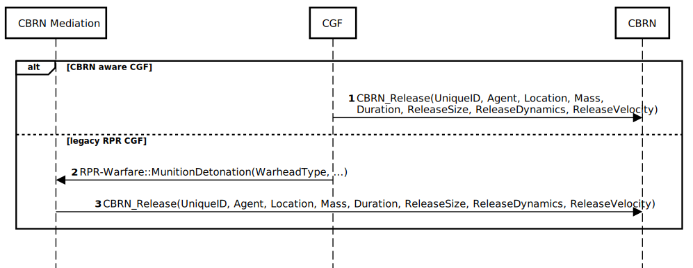

# NETN-CBRN
NATO Education and Training Network (NETN) Chemical, Biological, Radiological, Nuclear (CBRN) Module

Copyright (C) 2019 NATO/OTAN.
This work is licensed under a [Creative Commons Attribution-NoDerivatives 4.0 International License](LICENSE.md).

## Introduction

CBRN are Chemical, Biological, Radiological and Nuclear materials that can be delivered intentially as a weapon using conventional bombs, explosive materials and enhanced blast weapons (e.g., dirty bombs) or unintentionally caused by human error or natural or technological
reasons, such as spills, accidental releases or leakages. 

The NATO Education and Training Network CBRN Module (NETN-CBRN) is a specification of how to model CBRN releated concepts in a federated distributed simulation. 

The specification is based on IEEE 1516 High Level Architecture (HLA) Object Model Template (OMT) and primarily intended to support interoperability in a federated simulation (federation) based on HLA. A Federation Object Model (FOM) Module is used to specify how data is represented and exchanged in the federation. The NETN-CBRN FOM module is available as an XML file for use in HLA based federations.

### Purpose

NETN-CBRN provides a common standard interface for representation of CBRN release, detection, effects, and protective measueres in a federated distributed simulation. E.g the expoure effect on individual humans in a CBRN contaminated Hazard area where the humans are represented in one simulation and the effect is modelled in another federated simulation.

### Scope

The NETN-CBRN FOM module covers:

1.	CBRN Source release modelling
2.	CBRN Detector modelling
3.	CBRN Effects modelling
4.	CBRN Protective measures modelling
5.	Hazard area modelling

Meteorological conditions and CBRN material properties for modelling the dispersion of CBRN material are not explicitly represented in the NETN-CBRN FOM Module. NETN-METOC FOM module can be used to model wether conditions that may impact the dispersion of CBRN materials and cause dynmaic change to hazard areas.

### Overview

Whilst designing this CBRN FOM module considerations have been taken as to how the CBRN FOM module can be used by legacy systems that cannot be updated to implement the CBRN FOM module. These considerations have resulted in the CBRN FOM module including interactions that mirror the changes that can be made to objects. These interactions allow for a translation federate to sit between the CBRN and simulation federate to translate the CBRN data into data that the simulation federate can understand.

**Figure: CBRN Interaction Classes**

## CBRN Source Release

The `CBRN_Release` interaction include all of the CBRN source release information required for a CBRN federate to model a CBRN source release.

|Parameter|Description|
|---|---|
|UniqueID|Unique representation of the release’s ID.|
|Agent|The type of released CBRN hazardous agent.|
|Location|Initial location of the release in the geocentric location system.|
|Mass|Total released agent mass in kg.|
|Duration|Duration in seconds over which the release takes place.|
|ReleaseSize|The initial size of the release including initial Gaussian sigmas of the released puff and mean & variance of released particles.|
|ReleaseDynamics|Temperature differance and density ratio of released material relative to the atmosphere.|
|ReleaseVelocity|Velocity of the source term.|

The `CBRN_Release` interaction acts as a trigger for starting the simulation of a CBRN release event.

**Figure: Triggering a CBRN Release**
<!--
participant CBRN Mediation
participant CGF
participant CBRN
autonumber 1
alt CBRN aware CGF
CGF->CBRN:CBRN_Release(UniqueID, Agent, Location, Mass, \nDuration, ReleaseSize, ReleaseDynamics, ReleaseVelocity)
else legacy RPR CGF
CGF->CBRN Mediation:RPR-Warfare::MunitionDetonation(WarheadType, ...)
CBRN Mediation->CBRN:CBRN_Release(UniqueID, Agent, Location, Mass, Duration, ReleaseSize, ReleaseDynamics, ReleaseVelocity)
end
autonumber off
-->

1. The `CBRN_Release` interaction can be sent directly from a CBRN aware CGF to inform a CBRN federate that a release has occurred. 

However, in some federations an itermediate step is required to support the generation of the `CBRN_Release` interaction. 

2. A legacy RPR based CGF, not aware of NETN-CBRN concepts, can generate a RPR-Warfare `MunitionDetonation` interaction. 
3. A CBRN Mediation federate receives the `MunitionDetonation`. If the `WarheadType` parameter indicates that it is a CBRN release, then the CBRN Mediation federate sends the `CBRN_Release` interaction.

## CBRN Detector

There are two use cases for a detector in a HLA simulation:
1.	The first is for detector properties to be created and published by a simulation federate. A detector model within a CBRN federate would calculate the detector readings and publish the alarm status. This process would use the CBRN_Detector object and CBRN_DetectorAlarm interaction.
2.	The second would have a complete detector model in a federate; this would request concentration readings from a CBRN federate and calculate its own alarm status. This would use the CBRN_Sensor object and CBRN_SensorUpdate interaction.

Both the CBRN_Detector and CBRN_Sensor objects extend the BaseEntity.PhysicalEntity.Sensor object in the RPR Physical FOM module.
 
### CBRN_Detector

The CBRN_Detector object is used when a CGF creates a detector with a CBRN federate performing the modelling of the detector. When the federate controlling the detector calculates a concentration above a threshold, it will issue a CBRN_DetectorAlarm interaction.

### CBRN_Sensor

The CBRN_Sensor object is used when there is a detector federate performing the modelling of the detector. The CBRN_Sensor registers the agents that it is interested in and receives readings in the form of a CBRN_SensorUpdate interaction.
 
Figure 10-2: CBRN Detector Objects.
 
Figure 10-3: CBRN Detector Interactions.

## CBRN EFFECTS MODELLING

Previous systems utilising HLA as the interoperability mechanism have used representations of damage from existing object models for representing kinetic weapons in order to represent CBRN exposure. The representation of damage from kinetic models does not necessarily map well to represent CBRN exposure.

This section presents the use cases and data types for CBRN casualty modelling.

### Lifeform CBRN Effects Modelling

#### CBRN_Human 

The CBRN_Human object is an extension of the NETN_Human object from the NETN Physical FOM module. The CBRN federate will update the appropriate attributes as the casualty state of the entity changes. The TriageLevel uses the NATO representation of triage category scores [1]. The IPEType attribute denotes the level of Individual Protective Equipment (IPE) that the unit is wearing. These levels are those defined by the Nuclear, Biological and Chemical (NBC) dress states [2].
 
Figure 10-4: CBRN_Human Object.

#### CBRN_Casualty 

The CBRN_Casualty interaction is provided to give support to legacy systems that do not use the CBRN FOM module. A translation federate can then map the CBRN_Casualty interaction into a data type that the legacy system can use.

#### CBRNDamageEnum8 

The triage levels used in the CBRNDamageEnum8 enumeration uses the ‘T system’ to denote the priority of treatment for casualties where the levels are defined as:
*	T3 – Delayed priority.
*	T2 – Urgent priority.
*	T1 – Immediate priority.
*	T4 – Expectant priority (treatment would be ineffective).
 
Figure 10-5: CBRN_Casualty Interaction.

### Platform CBRN Effects Modelling

#### CBRN Platforms 

In order to calculate further contamination and exposure for a platform, extensions are made to seven NETN leaf nodes in the NETN Physical FOM module. These are all extensions of the Platform object from the RPR Physical FOM module. Each extension contains an array of the mass of all materials that are contaminating the vehicle.
 
Figure 10-6: CBRN Platform Objects.

#### CBRN_PlatformUpdate 

Using the same pattern as that used for the CBRN_Human object, the contaminating mass inside a platform due to embedded units can be updated by an external federate using the CBRN_PlatformUpdate interaction.
 
Figure 10-7: CBRN_PlatformUpdate Interaction.

## PROTECTIVE MEASURES MODELLING

The use case for protective measures covers both the modelling of CBRN treatment and the modelling of CBRN protective equipment. This includes both individual (i.e. a respirator) and collective protection (i.e. Collective Protection (COLPRO)).
 
### COLPRO

The COLPRO object extends the BaseEntity.PhysicalEntity.CulturalFeature.NETN_CulturalFeature and provides information on how many entities it can contain as well as what agents it provides protection against.

###	DecontaminationStation

The DecontaminationStation object also extends the BaseEntity.PhysicalEntity.CulturalFeature.NETN_CulturalFeature and provides information on how many entities it can contain as well as what agents it can provide decontamination for.
 
Figure 10-8: CBRN Protective Measures Objects.

### CBRN_FacilityUpdate

The CBRN_FacilityUpdate interaction is a base interaction that allows entities to be instructed to enter or leave a CBRN facility, it is not possible to publish or subscribe to this interaction.

### COLPROUpdate

The COLPROUpdate interaction extends the CBRN_FacilityUpdate and allows entities to be instructed to enter or leave a COLPRO object.

### DecontaminationStationUpdate

The DecontaminationStationUpdate interaction extends the CBRNFacilityUpdate and allows entities to be instructed to enter or leave a DecontaminationStation object.
 
### IPECommand

The IPECommand interaction allows entities to be instructed to don IPE by an external federate.

### CBRN_TreatmentCommand

The CBRN_TreatmentCommand can be used for both pre-mission countermeasures and for treatment to be applied post-exposure. The CBRN_Human object has an attribute which denotes the treatments that have been applied to the unit.
 
Figure 10-9: CBRN Protective Measures Interactions.

## HAZARD AREA MODELLING

The modelling of hazard areas allows the representation of a contamination area to be sent to a simulation federate in the simplest possible form. This could be in the form of:

* The output from a hazard prediction algorithm (a warning area defined in Allied Tactical Publication (ATP)-45) [3] in response to a detector alarm or observation.
*	Raw output from a dispersion model (contours) during a simulation run.

### ATP45HazardArea

The ATP45HazardArea object represents the hazard region as calculated by a warning and reporting model. Currently only a subset of the ATP-45 definition is used.

### ProbabilityHazardContourGroup

The ProbabilityHazardContourGroup object provides a representation of the hazard area of the casualty effects of this CBRN hazard, calculated from the properties of the particular material.

### RawDataHazardContourGroup
The RawDataHazardContourGroup object provides a representation of the raw dispersion output which is purely the quantity of the material calculated by a dispersion model.
 
Figure 10-10: CBRN Hazard Area Objects.
