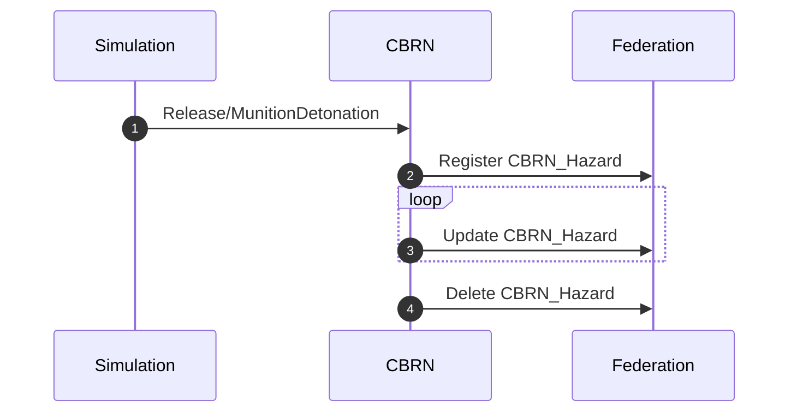
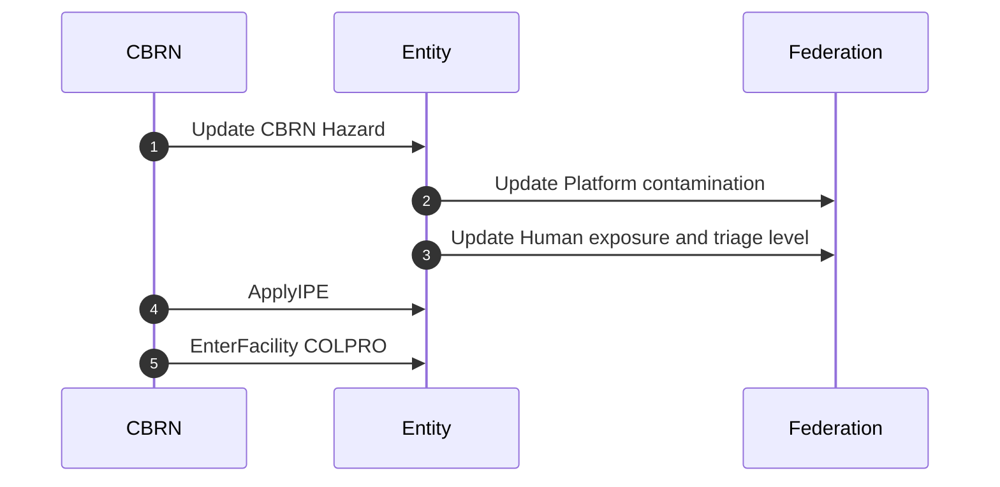
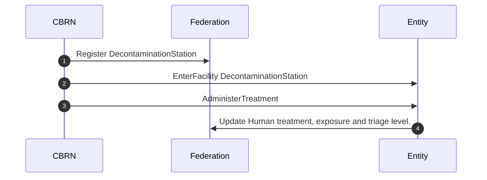
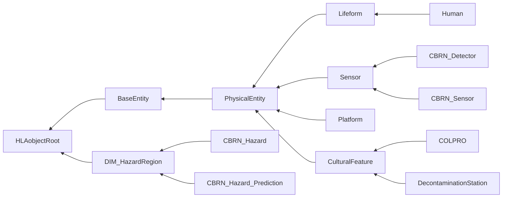

# NETN-CBRN
|Version| Date| Dependencies|
|---|---|---|
|v2.0|2023-03-28|NETN-Physical, NETN-SE|

The NATO Education and Training Network (NETN) CBRN FOM Module (NETN-CBRN) provides a common standard interface for the representation of CBRN release, detection, effects, and protective measures in a federated distributed simulation. E.g the exposure effect on individual humans in a CBRN contaminated Hazard area where the human is represented in one simulation and the effect is modelled in another federate simulation.

CBRN are Chemical, Biological, Radiological and Nuclear materials that can be delivered intentionally as a weapon using conventional bombs, explosive materials and enhanced blast weapons (e.g., dirty bombs) or unintentionally caused by human error or natural or technological reasons, such as spills, accidental releases or leakages. 

The NETN-CBRN FOM Module is a specification of how to model CBRN-related events in a federated distributed simulation. 

The specification is based on IEEE 1516 High Level Architecture (HLA) Object Model Template (OMT) and is primarily intended to support interoperability in a federated simulation (federation) based on HLA. A Federation Object Model (FOM) Module is used to specify how data is represented and exchanged in the federation. The NETN-CBRN FOM module is available as an XML file for use in HLA-based federations. 

The NETN-CBRN FOM module covers:  
        
1.	CBRN Source release modelling 
2.	CBRN Detector modelling 
3.	CBRN Effects modelling 
4.	CBRN Protective measures modelling
5.	Hazard area modelling  
 
 Meteorological conditions and CBRN material properties for modelling the dispersion of CBRN material are not explicitly represented in the NETN-CBRN FOM Module. NETN-METOC FOM module can be used to model weather conditions that may impact the dispersion of CBRN materials and cause dynamic change to hazard areas.

## Overview

Modelling and Simulation of CBRN involve the following aspects:
1. Triggering the release of CBRN agents 
2. Modelling CBRN agent concentration and spreading 
3. Modelling the result of decontamination activities
3. Modelling the effects of the CBRN agents on simulated entities
4. CBRN Sensor modelling and the detection of CBRN agents

Depending on the federation design, these aspects are modelled in one or more CBRN federates.

### CBRN Release and Spreading

1. The `Release` interaction is a trigger for starting the simulation of a `CBRN_Hazard`. In some cases, the trigger is implicit and related to an RPR-FOM Warfare `MunitionDetonation` event with a `WarheadType` parameter indicating a CBRN release. 
2. Register a `CBRN_Hazard` object class to represent the hazard
3. Update the `CBRN_Hazard` object continuously to reflect the spreading of CBRN agents.
4. Delete the `CBRN_Hazard` object when there is no longer any hazard.

### CBRN Effects on Entities

Lifeforms are affected by CBRN agents over time but by using protective measures the effect can be reduced. In addition, treatments to mitigate the effect of exposure to CBRN agents can be administered and decontamination activities can reduce the risk of exposure.

1. Update `CBRN_Hazard` concentrations and contours. Entities located inside a `CBRN_Hazard` will be subjected to exposure and contamination accumulated over time.
2. Update contamination of platforms in the hazard area
3. Update exposure and triage level of humans in the hazard area or indirectly affected by contaminated platforms.
4. To protect against CBRN agents, an entity can be tasked to use Individual Protection Equipment (IPE)
5. In addition, the entity can be tasked to enter a Collective Protection (COLPRO) facility. Use the NETN-ETR task `EnterFacility` referencing a `COLPRO` object.

1. Register `DecontaminationStation` for providing treatment and decontamination to exposed entities
2. To treat and decontaminate exposed entities, they can be tasked to enter a `DecontaminationStation`
3. In addition, treatments can be directly administered by tasking an entity to perform treatment on another exposed entity.
4. Update entities after decontamination and treatments

### CBRN_Detector

Modelling the detection of CBRN agents in a federated simulation environment can use three different design approaches. 

1. Simulation of Either the detection modelling is handled by same federate that models the CBRN sensors or these are sparated in two 

1. Sim publish Detector, Detector modelled by CBRN federate and sends DetectorAlarms

2. Sim models detector, Sensor modelled by CBRN federate that produce sensor updates

There are two use cases for a detector in an HLA simulation:
1.  The first is for detector properties to be created and published by a simulation federate. A detector model within a CBRN federate would calculate the detector readings and publish the alarm status. This process would use the CBRN_Detector object and CBRN_DetectorAlarm interaction.
2.  The second would have a complete detector model in a federate; this would request concentration readings from a CBRN federate and calculate its alarm status. This would use the CBRN_Sensor object and CBRN_SensorUpdate interaction.

Both the `CBRN_Detector` and `CBRN_Sensor` objects extend the BaseEntity.PhysicalEntity.Sensor object in the RPR Physical FOM module.
 

The `CBRN_Detector` object is used when a CGF creates a detector with a CBRN federate performing the modelling of the detector. When the federate controlling the detector calculates a concentration above a threshold, it will issue a `CBRN_DetectorAlarm` interaction.

### CBRN_Sensor

The `CBRN_Sensor` object is used when there is a detector federate performing the modelling of the detector. The `CBRN_Sensor` registers the agents that it is interested in and receives readings in the form of a `CBRN_SensorUpdate` interaction.
 

A `CBRN_Hazard_Prediction` is a prediction of a hazard area and the output of a hazard prediction algorithm (a warning area defined in Allied Tactical Publication (ATP)-45) in response to a detector alarm or observation.

### CBRN Effects,  Protective Measures and Treatment

The `Human` and `Platform` object classes are extended to represent CBRN-related effects. 

The use case for protective measures covers both the modelling of CBRN treatment and the modelling of CBRN protective equipment. This includes both individual protection equipment (IPE) and collective protection (COLPRO). 

The `COLPRO` and `DecontaminationStation` object classes extend the `NETN_CulturalFeature`` object class and provide information on how many entities it can contain as well as what agents it protects against.

Use the `ApplyIPEC` interaction to task entities to apply individual protection equipment (IPE). 

Use the `AdminiterTreatment` interaction to task an entity to administer treatments for pre-mission countermeasures or post-exposure.
 

## Object Classes

Note that inherited and dependency attributes are not included in the description of object classes.

### Human

A human lifeform.

|Attribute|Datatype|Semantics|
|---|---|---|
|Exposures|ArrayOfCBRNExposureStruct|Array of agents to which this entity has been exposed to. Defaults to an empty array.|
|Treatments|ArrayOfTreatmentStruct|The types of treatment that this entity has used. Defaults to an empty array.|
|TriageLevel|CBRNDamageEnum8|Triage level of this entity. Defaults to Uninjured.|
|IPEType|IPETypeEnum8|Type of IPE that the entity is using. Defaults to None.|

### CBRN_Detector

Represents a CBRN detector. This object is used to pass information to a CBRN federate, which will model the detector internally and publish a CBRN_DetectorAlarm.

|Attribute|Datatype|Semantics|
|---|---|---|
|ProcessingTime|TimeSecondInteger32|Duration between the detector being exposed to a concentration of agent above its threshold and the detector raising an alarm.|
|AveragingTime|TimeSecondInteger32|Duration the detector will collect samples.|
|DetectableAgents|ArrayOfAgentConcentrationStruct|Array of detectable agents and their thresholds.|
|Alarm|CBRNAlarmStruct|Data representing the alarm of this detector. Defaults to no alarm if the attribute is not set.|

### CBRN_Sensor

Represents a CBRN sensor. This object is used to pass information to a CBRN federate, which will return sensor readings by publishing CBRN_SensorUpdate interactions.

|Attribute|Datatype|Semantics|
|---|---|---|
|UpdateFrequency|TimeSecondInteger32|Duration that this sensor would like between updated readings.|
|AveragingTime|TimeSecondInteger32|Duration the sensor will collect samples.|
|DetectableAgents|ArrayOfAgentTypeEnum|Array of agents that this sensor wishes to detect.|
|SensorReadings|ArrayOfCBRNSensorReadingStruct|Latest sensor readings. Defaults to no readings if this attribute is not set.|

### Platform

A physical object under the control of armed forces upon which sensor, communication, or weapon systems may be mounted.

|Attribute|Datatype|Semantics|
|---|---|---|
|Contamination|ArrayOfAgentMassStruct|CBRN hazardous agent inside vehicle due to embedded units.|

### COLPRO

Represents a feature that provides Collective Protection (COLPRO) against a CBRN threat.

|Attribute|Datatype|Semantics|
|---|---|---|
|Capacity|QuantityInt32|The number of entities that this COLPRO can handle.|
|Protection|ArrayOfProtectionEffectivenessStruct|The effectiveness that this COLPRO offers for each agent.|

### DecontaminationStation

Represents a feature that provides treatment for CBRN exposure.

|Attribute|Datatype|Semantics|
|---|---|---|
|Capacity|QuantityInt32|The number of entities that this decontamination station can handle.|
|DecontaminationPeriod|TimeSecondInteger32|Duration it takes to decontaminate an entity.|
|Treatments|ArrayOfTreatmentStruct|The types of treatment that this decontamination station currently offers.|

### CBRN_Hazard

A generic representation of a CBRN Hazard.

|Attribute|Datatype|Semantics|
|---|---|---|
|AgentType|AgentTypeEnum16|Requierd: Agent reflected in this contour.|
|Contours|ArrayOfContourStruct|Optional: Array of contours. These should be ordered in a sequence of ascending PercentProbabilityLevel.|
|ExposureType|ExposureEffectTypeEnum16|Optional: The type of effects seen following an exposure. The default is no effect.|
|HazardType|HazardTypeEnum8|Type of hazard.|

### CBRN_Hazard_Prediction

Represents the footprint generated by a CBRN warning and reporting simulation. This follows the NATO ATP-45 doctrine to generate a hazard area.

|Attribute|Datatype|Semantics|
|---|---|---|
|Duration|TimeSecondInteger32|Duration  that this hazard prediction is valid.|
|ATP45HazardAreaType|ATP45HazardAreaTypeEnum8|This hazard area's type|
|AgentClass|AgentClassEnum8|The agent class|

## Interaction Classes

Note that inherited and dependency parameters are not included in the description of interaction classes.

### Release

Communicates information associated with the release of hazardous agent.

|Parameter|Datatype|Semantics|
|---|---|---|
|Agent|AgentTypeEnum16|The type of released CBRN hazardous agent.|
|Location|LocationStruct|Initial location of the release in the geocentric location system.|
|Mass|MassKilogramFloat32|Total released agent mass in kg.|
|Duration|TimeSecondInteger32|Duration the release takes place.|
|ReleaseSize|ReleaseSizeStruct|The initial size of the release including initial Gaussian sigmas of the released puff and mean & variance of released particles.|
|ReleaseDynamics|ReleaseDynamicsStruct|Temperature differance and density ratio of released material relative to the atmosphere.|
|ReleaseVelocity|VelocityVectorStruct|Velocity of the source term.|

### PlatformUpdate

Represents an update to the contaminating mass inside a vehicle due to embedded entities.

|Parameter|Datatype|Semantics|
|---|---|---|
|Platform|UUID|The unique ID of the platform.|
|Contamination|ArrayOfAgentMassStruct|New state of CBRN hazardous agent inside vehicle due to embedded units.|

### CasualtyUpdate

Informs the federate representing the entity of the casualty effects of exposure.

|Parameter|Datatype|Semantics|
|---|---|---|
|Entity|UUID|Required: Reference to the entity affected by CBRN.|
|TriageLevel|CBRNDamageEnum8|Required: Triage level of this entity.|
|Exposures|ArrayOfCBRNExposureStruct|Optional: Array of agents to which this unit has been exposed.|

### SensorUpdate

Sends information about the current state of a previously registered CBRN sensor.

|Parameter|Datatype|Semantics|
|---|---|---|
|Sensor|UUID|Required: Unique representation of the sensor’s ID.|
|Concentration|MassConcentrationFloat32|Required: Mean Concentration in kg m-3.|
|Agent|AgentTypeEnum16|Required: Type of the agent.|

### DetectorAlarm

Represents the alarm trigger of a previously registered CBRN detector.

|Parameter|Datatype|Semantics|
|---|---|---|
|Agent|AgentTypeEnum16|Enumeration representation of the agent.|
|Location|LocationStruct|Required: Location of the detection (location of Detector)|
|DetectorId|UUID|Optional: Reference to detector object.|

### ApplyIPE

Represents an task for the specified entities to use individual protective equipment.

|Parameter|Datatype|Semantics|
|---|---|---|
|TaskParameters|ApplyIPETaskStruct|Required: Task parameters.|

### AdministerTreatment

Represents an order for the specified entities to receive the list of treatments.

|Parameter|Datatype|Semantics|
|---|---|---|
|TaskParameters|AdministerTreatmentTaskStruct|Required: Task parameters.|

## Datatypes

Note that only datatypes defined in this FOM Module are listed below. Please refer to FOM Modules on which this module depends for other referenced datatypes.

### Overview
|Name|Semantics|
|---|---|
|ATP45HazardAreaTypeEnum8|Type of ATP-45 Hazard Area (simple or detailed).|
|AdministerTreatmentTaskStruct|Task-specific data.|
|AgentClassEnum8|Class of Agent for an ATP-45 Hazard Area.|
|AgentConcentrationStruct|Concentration value associated with a specific agent.|
|AgentMassStruct|Mass of contaminant inside a vehicle brought in by an embedded unit.|
|AgentTypeEnum16|Type of CBRN hazardous agent.|
|ApplyIPETaskStruct|Task-specific data.|
|ArrayOfAgentConcentrationStruct|Array of agents and their concentrations.|
|ArrayOfAgentMassStruct|Array of agents and their masses.|
|ArrayOfAgentTypeEnum|Array of agents.|
|ArrayOfCBRNExposureStruct|Array of agents and their dosages.|
|ArrayOfCBRNSensorReadingStruct|Array of sensor readings.|
|ArrayOfContourStruct|A set of contour boundaries defining concentration levels in ascending order.|
|ArrayOfProtectionEffectivenessStruct|Array of the protection’s effectiveness.|
|ArrayOfSigmas6|Size of the initial Gaussian puff sigma values.|
|ArrayOfTreatmentStruct|Array of TreatmentStruct types.|
|CBRNAlarmStruct|Properties of a CBRN alarm.|
|CBRNDamageEnum8|Level of damage due to CBRN exposure.|
|CBRNExposureStruct|Dosage exposure value associated with a specific agent.|
|CBRNSensorReadingStruct|Timed CBRN sensor reading.|
|ContourStruct|Countour description.|
|DensityRatioFloat32|Ratio of density of two materials in range [0, 1].|
|DosageKgSecondPerMeterCubedFloat32|Dosage in SI units.|
|ExposureEffectTypeEnum16|The type of CBRN agent will define the type of effects seen following an exposure, these are: Intoxication: This is due to a chemical (and toxin) exposure. Infection: This is due to a live biological agent exposure. Irradiation: This is due to ionising radiation exposure. Injuries: This is due to exposure to trauma or climatic stress (heat) either in isolation or as a combined injury (CBRN and trauma). The delivery method of the CBRN agent may cause trauma as well as physical degradation from individual protective equipment (IPE) use (heat injury).|
|ExposureFloat32|Data type for exposure.|
|ExposureTypeEnum8|Type of exposure represented in a contour group.|
|HazardTypeEnum8|Type of dispersion output represented in a contour group.|
|IPETypeEnum8|Types of Individual Protective Equipment.|
|MeanMetersFloat32|Mean of a Gaussian distribution, based on SI unit meter, unit symbol m.|
|ProtectionEffectivenessStruct|Protection effectiveness associated with a specific agent.|
|ReleaseDistributionStruct|Mean and variance of the distribution of the particles or droplets in a release.|
|ReleaseDynamicsStruct|Defines the dynamic properties of a release.|
|ReleaseSizeStruct|Defines the properties of the initial size of a release.|
|TaskDefinitionVariantRecord|Variant record for task definition data.|
|TaskProgressVariantRecord|Variant record for task progress data.|
|TaskTypeEnum|Task types.|
|TreatmentStruct|Defines the properties for a CBRN treatment.|
|VarianceMetersSquaredFloat32|Variance of a Gaussian distribution, based on SI unit meter squared, unit symbol m2.|
        
### Simple Datatypes
|Name|Units|Semantics|
|---|---|---|
|DensityRatioFloat32|NA|Ratio of density of two materials in range [0, 1].|
|DosageKgSecondPerMeterCubedFloat32|Kg Second Per Meter Cubed|Dosage in SI units.|
|ExposureFloat32|NA|Data type for exposure.|
|MeanMetersFloat32|meters|Mean of a Gaussian distribution, based on SI unit meter, unit symbol m.|
|VarianceMetersSquaredFloat32|meters squared|Variance of a Gaussian distribution, based on SI unit meter squared, unit symbol m2.|
        
### Enumerated Datatypes
|Name|Representation|Semantics|
|---|---|---|
|ATP45HazardAreaTypeEnum8|HLAoctet|Type of ATP-45 Hazard Area (simple or detailed).|
|AgentClassEnum8|HLAoctet|Class of Agent for an ATP-45 Hazard Area.|
|AgentTypeEnum16|HLAinteger16BE|Type of CBRN hazardous agent.|
|CBRNDamageEnum8|HLAoctet|Level of damage due to CBRN exposure.|
|ExposureEffectTypeEnum16|HLAinteger16BE|The type of CBRN agent will define the type of effects seen following an exposure, these are: Intoxication: This is due to a chemical (and toxin) exposure. Infection: This is due to a live biological agent exposure. Irradiation: This is due to ionising radiation exposure. Injuries: This is due to exposure to trauma or climatic stress (heat) either in isolation or as a combined injury (CBRN and trauma). The delivery method of the CBRN agent may cause trauma as well as physical degradation from individual protective equipment (IPE) use (heat injury).|
|ExposureTypeEnum8|HLAoctet|Type of exposure represented in a contour group.|
|HazardTypeEnum8|HLAoctet|Type of dispersion output represented in a contour group.|
|IPETypeEnum8|HLAoctet|Types of Individual Protective Equipment.|
|TaskTypeEnum|HLAinteger32BE|Task types.|
        
### Array Datatypes
|Name|Element Datatype|Semantics|
|---|---|---|
|ArrayOfAgentConcentrationStruct|AgentConcentrationStruct|Array of agents and their concentrations.|
|ArrayOfAgentMassStruct|AgentMassStruct|Array of agents and their masses.|
|ArrayOfAgentTypeEnum|AgentTypeEnum16|Array of agents.|
|ArrayOfCBRNExposureStruct|CBRNExposureStruct|Array of agents and their dosages.|
|ArrayOfCBRNSensorReadingStruct|CBRNSensorReadingStruct|Array of sensor readings.|
|ArrayOfContourStruct|ContourStruct|A set of contour boundaries defining concentration levels in ascending order.|
|ArrayOfProtectionEffectivenessStruct|ProtectionEffectivenessStruct|Array of the protection’s effectiveness.|
|ArrayOfSigmas6|LengthMeterFloat32|Size of the initial Gaussian puff sigma values.|
|ArrayOfTreatmentStruct|TreatmentStruct|Array of TreatmentStruct types.|
        
### Fixed Record Datatypes
|Name|Fields|Semantics|
|---|---|---|
|AdministerTreatmentTaskStruct|Entities, Treatment, Duration|Task-specific data.|
|AgentConcentrationStruct|MeanConcentration, Agent|Concentration value associated with a specific agent.|
|AgentMassStruct|ContaminatedMass, Agent|Mass of contaminant inside a vehicle brought in by an embedded unit.|
|ApplyIPETaskStruct|IPEType|Task-specific data.|
|CBRNAlarmStruct|Location, Agent|Properties of a CBRN alarm.|
|CBRNExposureStruct|Exposure, Agent|Dosage exposure value associated with a specific agent.|
|CBRNSensorReadingStruct|Time, Reading|Timed CBRN sensor reading.|
|ContourStruct|Boundary, ProbabilityLevel, ConcentrationLevel|Countour description.|
|ProtectionEffectivenessStruct|Effectiveness, Agent|Protection effectiveness associated with a specific agent.|
|ReleaseDistributionStruct|Mean, Variance|Mean and variance of the distribution of the particles or droplets in a release.|
|ReleaseDynamicsStruct|DensityRatio, TemperatureDifference|Defines the dynamic properties of a release.|
|ReleaseSizeStruct|SigmaArray, ReleaseDistribution|Defines the properties of the initial size of a release.|
|TreatmentStruct|Effectiveness, Duration, TreatmentWindow, TreatableAgents|Defines the properties for a CBRN treatment.|
        
### Variant Record Datatypes
|Name|Discriminant (Datatype)|Alternatives|Semantics|
|---|---|---|---|
|TaskDefinitionVariantRecord|TaskType (TaskTypeEnum)|ApplyIPE, AdministerTreatment|Variant record for task definition data.|
|TaskProgressVariantRecord|TaskType (TaskTypeEnum)|Treatment|Variant record for task progress data.|
    